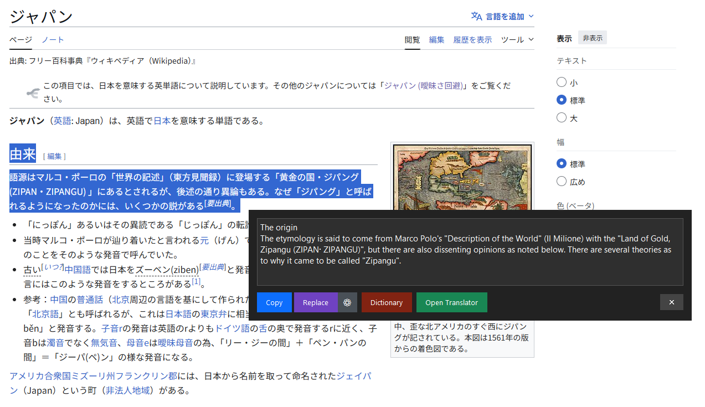
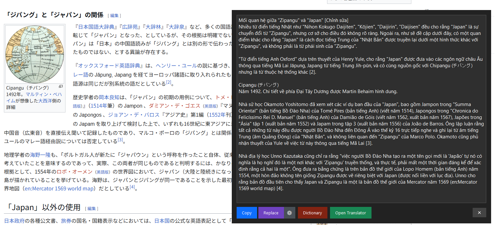
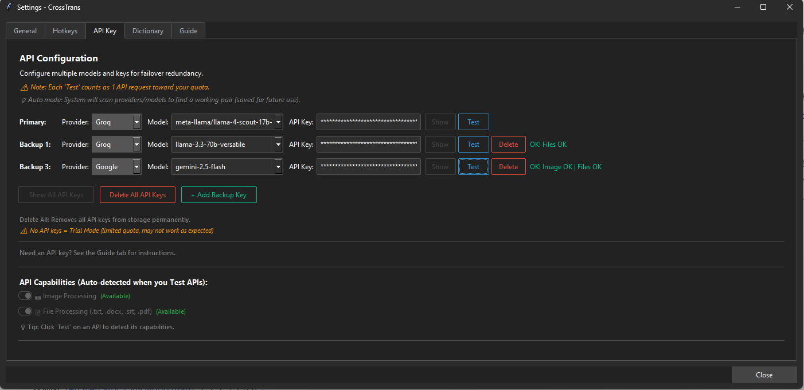
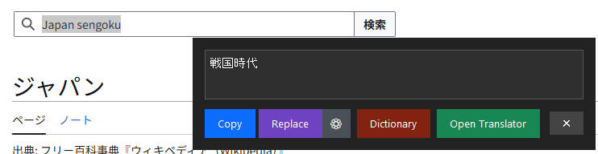

# CrossTrans


**Translate anything on your screen — instantly.** Select text in any app, press a hotkey, get the translation in a popup. Can't select text? Press `Win+Alt+S` to screenshot and translate. Works across every platform on your desktop: browsers, PDFs, IDEs, games, images, videos — if you can see it, you can translate it. Powered by 15 AI providers and 180+ models.


## Table of Contents

- [Highlights](#highlights)
- [Screenshots](#screenshots)
- [Features](#features)
- [Installation](#installation)
- [Usage](#usage)
- [Configuration](#configuration)
- [Security & Privacy](#security--privacy)
- [Troubleshooting](#troubleshooting)
- [Project Structure](#project-structure)
- [Contributing](#contributing)
- [Changelog](#changelog)
- [License](#license)

---

## Highlights

- **Translate Anywhere** — Works in any app: browsers, PDFs, Word, IDEs, Slack, Discord, games — no plugin needed
- **Two Ways to Translate** — Select text + hotkey for instant translation, or `Win+Alt+S` to screenshot any region (even non-selectable text in images, videos, games)
- **Zero Context Switching** — Translation popup appears right at your cursor, in-place. No need to open a browser tab, copy-paste, or switch windows
- **Replace in Source** — One-click replace selected text with the translation, right in the source app
- **Dictionary Mode** — Click words for definitions, pronunciation, synonyms, antonyms, examples
- **Free Trial Mode** — Daily free translations without API key
- **15 AI Providers** — Google, OpenAI, Anthropic, DeepSeek, Groq, and more (many offer free tiers)
- **File Processing** — Translate documents (.docx, .txt, .srt, .pdf) and images
- **100+ Languages** — Comprehensive language support with custom hotkeys

---

## Screenshots

### Quick Translate

Translation appears as a popup near the cursor with action buttons (Copy, Replace, Dictionary, Open Translator).



### Screenshot OCR

Press `Win+Alt+S` to capture any screen region for instant OCR and translation.




### Settings — API Key

Configure providers, models, and test connections. Multiple API keys supported for automatic failover.



### Replace Preview

Preview before replacing: strikethrough original text with translated text below, then Agree or Cancel.




---

## Features

### Translate Anywhere — The Core Advantage

CrossTrans is designed for people who work across multiple platforms and need instant translation without leaving their workflow.

**Method 1: Select Text + Hotkey** — Works in any application that supports text selection:
- Browsers (Chrome, Firefox, Edge), PDF readers, Word, Excel, PowerPoint
- IDEs (VS Code, IntelliJ, Visual Studio), text editors, terminals
- Chat apps (Slack, Discord, Teams, Telegram), email clients
- Any Windows application — no plugin or extension needed

**Method 2: Screenshot OCR (`Win+Alt+S`)** — For text you can't select:
- Images, videos, games, streaming content
- Scanned PDFs, embedded text in graphics
- Foreign-language UI elements, error messages, menus
- Any text visible on your screen — just capture the region

> **Why this matters:** Traditional translation tools require you to copy text, open a browser, paste into Google Translate, and switch back. CrossTrans eliminates all of that — the translation appears right where you're working, in under a second.

### Quick Translation Hotkeys
| Hotkey | Action |
|--------|--------|
| `Win+Alt+V` | Translate to Vietnamese |
| `Win+Alt+E` | Translate to English |
| `Win+Alt+J` | Translate to Japanese |
| `Win+Alt+C` | Translate to Chinese Simplified |
| `Win+Alt+S` | **Screenshot OCR Translation** |

**+ 4 customizable hotkeys** for any language of your choice.

### Free Trial Mode
- **Daily free translations** without any API key — quota refreshes daily at midnight
- Perfect for trying out the app before getting your own API key

### Screenshot Translation
- **Win+Alt+S** — Capture any screen region for instant OCR and translation
- **Multi-monitor support** — Works across all connected displays
- **Visual selection** — Semi-transparent overlay with drag selection
- **Configurable target language** — Set in Settings > Hotkeys tab
- **Open Translator integration** — Screenshot loads into Attachments for further editing

### Replace in Source App
- **Replace button** in popup — Paste translation directly back into the source app
- **Manual mode** (default): Preview with strikethrough original → translated text, then Agree/Cancel
- **Quick mode**: Immediate paste without preview (toggle in Settings → Hotkeys → Replace Mode)
- **Gear icon (⚙)**: Quick access to replace mode settings

### Dictionary Mode
- Click **Dictionary** button in popup to enter word selection mode
- Click any word for detailed lookup: translation, definition, word type, pronunciation, synonyms, antonyms, examples
- Smart word filtering across all languages (Latin, CJK, Cyrillic, Arabic, Thai, Korean)
- **Language packs**: Go to Settings → Dictionary tab to install. Python 3.10+ must be on your system PATH for language pack downloads (the EXE itself does not require Python).

### File Processing
- **Image Translation** — Drag & drop images for OCR and translation
- **Document Support** — Process `.docx`, `.txt`, `.srt`, `.pdf` files
- **Multi-file Batch** — Translate multiple files in a single API request
- **Drag & Drop** — Simply drop files onto the translator window
- **Double-click Preview** — Open attached files with system default app

### Multi-Provider Support

| Provider | Provider |
|----------|----------|
| Google Gemini | OpenAI |
| Anthropic | DeepSeek |
| Groq | xAI |
| Mistral | Perplexity |
| Cerebras | SambaNova |
| Together | SiliconFlow |
| OpenRouter (400+) | HuggingFace |

Many providers offer free API keys. See Settings → Guide tab for details.

**Smart Routing** — Paste any API key and CrossTrans automatically detects the provider. Or select manually.

### User Interface
- **Quick Translate Popup** — Translation appears near cursor, auto-sizes to content
- **Full Translator** — Rich window with language selector, custom prompts, attachments
- **Dark Theme** — Modern UI with ttkbootstrap
- **System Tray** — Runs quietly in background
- **Translation History** — Review and reuse past translations (up to 100 entries)

### Other Features
- **Custom Prompts** — Add instructions like "Make it formal" or "Technical terms only"
- **Clipboard Preservation** — Files/images in clipboard are preserved after translation
- **Auto-start** — Optionally start with Windows
- **Auto-update** — Get notified of new versions with one-click install

---

## Installation

### Option 1: Download EXE (Recommended)

**Prerequisites:** Windows 10/11

1. Go to [Releases](https://github.com/Masaru-urasaM/CrossTrans/releases/latest)
2. Download `CrossTrans_v{version}.exe`
3. Run the application
4. Start translating with trial mode, or enter your API key in Settings

> **Note:** On first run, Windows SmartScreen may show "Windows protected your PC".
> Click **"More info"** → **"Run anyway"**. This is normal for unsigned applications.

### Option 2: Run from Source

**Prerequisites:** Windows 10/11, Python 3.10+

```bash
git clone https://github.com/Masaru-urasaM/CrossTrans.git
cd CrossTrans
pip install -r requirements.txt
python main.py
```

### Get an API Key (Optional)

Many providers offer free API keys. Get one from any supported provider and paste it in Settings → API Key tab. See the in-app Guide tab for step-by-step instructions.

---

## Usage

### Basic Translation
1. **Start the app** — Look for "CT" icon in system tray
2. **Select any text** in any application
3. **Press hotkey** (e.g., `Win+Alt+V` for Vietnamese)
4. **Translation appears** in a popup near your cursor

### Quick Translate Actions

| Button | Action |
|--------|--------|
| **Copy** | Copy translation to clipboard |
| **Replace** | Replace selected text in source app with translation |
| **⚙** | Quick access to Replace mode settings |
| **Dictionary** | Open word-by-word lookup mode |
| **Open Translator** | Open full translator window with more options |
| **×** / `Escape` | Close popup |

### Full Translator Window
Right-click CT tray icon → **Open Translator**, or click from popup.

- Edit original text
- Choose from 100+ languages
- Add custom prompt for translation style
- Attach images or files
- View translation history

### File Translation
1. Open Full Translator
2. Click **+** button or drag & drop files
3. Supported: Images (PNG, JPG, GIF, WebP), Documents (DOCX, TXT, SRT, PDF)
4. Click Translate — all files processed in single API call

---

## Configuration

### Settings Tabs

#### General
- Auto-start with Windows
- Check for updates on startup
- Enable/disable translation history
- Theme selection

#### Hotkeys
- View default hotkeys (Win+Alt+V/E/J/C/S)
- Record custom hotkeys (click "Record" then press key combination)
- Assign any language to custom hotkeys
- Replace Mode toggle (Quick Replace vs Manual Replace with preview)

#### API Key
- Add multiple API keys for automatic failover
- Auto-detect provider from API key, or select manually
- Test connection and vision/file capabilities
- Backup keys activate when primary fails

#### Dictionary
- Install NLP language packs for better word tokenization
- Supports 30+ languages including Japanese, Chinese, Korean
- Python 3.10+ must be on your system PATH for language pack downloads

#### Guide
The built-in Guide tab contains comprehensive documentation for every feature:
- Getting Started, Quick Translate, Replace Mode
- Hotkeys, Screenshot Translation, Dictionary Mode
- File Translation, AI Providers, Tips & Tricks
- Troubleshooting

**Open Settings and click the Guide tab for the complete reference.**

### Custom Prompts
In translator window, use "Custom prompt" field:
- "Make it formal" — Business communication
- "Use casual tone" — Friendly messages
- "Technical translation" — Documentation
- "Explain like I'm 5" — Simple explanations
- "Preserve formatting" — Keep structure

---

## Security & Privacy

- **Encrypted API keys** — Stored locally using Windows DPAPI encryption; never sent anywhere except to the AI provider you choose
- **Windows Hello** — Optional biometric lock for API key access
- **No telemetry** — CrossTrans collects no usage data, analytics, or crash reports
- **Direct-to-provider** — Your text goes straight from your machine to the AI provider's API; no intermediary server (except in trial mode)
- **Single instance lock** — TCP socket on `127.0.0.1:47823` prevents duplicate instances

---

## Troubleshooting

### API Error / Connection Failed
1. Open Settings → API Key tab
2. Verify your API key is correct
3. Select correct Provider (or use "Auto")
4. Click "Test" to verify connection

### Translation Not Working
- Ensure text is selected (try Ctrl+C manually first)
- Wait for cooldown (2 seconds between translations)
- Some apps may block clipboard access
- Check logs folder for error details

### Hotkeys Not Working
- Check Settings → Hotkeys for configured shortcuts
- Try running as administrator
- Some apps capture certain key combinations
- Ensure no hotkey conflicts with other software

### Vision/File Features Disabled
- You need a vision-capable model — check Settings → API Key tab, click "Test"
- If test shows "Image OK", vision is enabled
- Not all models support vision; try a different model if needed

### Dictionary Mode Not Working
- Language packs require Python 3.10+ installed on your system and added to PATH
- The EXE itself doesn't need Python, but downloading language packs uses pip
- Go to Settings → Dictionary tab to install language packs
- If Python is not found, install it from [python.org](https://python.org) (check "Add to PATH")

### Trial Mode Issues
- Trial mode requires internet connection
- Daily quota is set dynamically (check the app UI for current limit)
- If quota exhausted, wait until midnight or add your own API key

---

## Project Structure

```
CrossTrans/
├── main.py                  # Entry point
├── config.py                # Configuration management
├── requirements.txt         # Dependencies
├── src/
│   ├── app.py               # Main application coordinator
│   ├── constants.py         # Languages, providers, models
│   ├── core/                # Business logic (API, translation, hotkeys, crypto, etc.)
│   ├── ui/                  # UI components (quick_translate, tray, dialogs, settings, etc.)
│   ├── utils/               # Helpers (updates, logging, single instance)
│   └── assets/              # Icon assets
├── docs/                    # Documentation and screenshots
├── tests/                   # Unit tests
└── logs/                    # Application logs
```

---

## Contributing

Contributions are welcome! Please feel free to submit a Pull Request.

### Development Setup
```bash
git clone https://github.com/Masaru-urasaM/CrossTrans.git
cd CrossTrans
pip install -r requirements.txt
python main.py
```

### Building EXE
```bash
pip install pyinstaller
pyinstaller CrossTrans.spec
# Output: dist/CrossTrans_v{version}.exe
```

### Running Tests
```bash
pip install pytest pytest-cov pytest-mock
pytest tests/ --cov=src --cov-report=html
```

---

## Changelog

See [CHANGELOG.md](CHANGELOG.md) for version history and release notes.

---

## License

This project is licensed under the GNU Affero General Public License v3.0 — see the [LICENSE](LICENSE) file for details.

---

## Acknowledgments

- Powered by 15+ AI providers including Google, OpenAI, Anthropic, and more
- Built with Python, Tkinter, and ttkbootstrap

---

**Made with care for translators, developers, and anyone who works across languages.**
